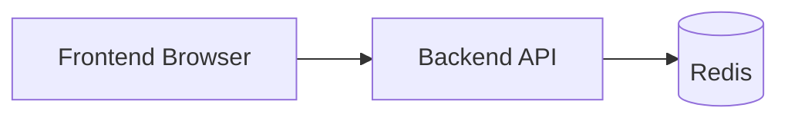

# Redis Rate Limiting + Pub/Sub + Jest Testing (Basics to Advanced)

This guide explains:

1. Redis connection basics for backend and frontend architecture
2. Redis Pub/Sub basics and implementation
3. Rate limiting basics with global and per-API limiters
4. API testing with Jest (you wrote "zest"; in Node.js this is usually Jest)
5. Advanced production patterns for all of the above

## 1) Redis Basics

### What Redis is

Redis is an in-memory data store used for:

- Caching
- Rate limiting counters
- Session/token storage
- Pub/Sub messaging

Because Redis is very fast, it is ideal for API throttling and real-time message fanout.

### Backend Redis Connection (Node.js + ioredis)

Install dependencies:

```bash
npm install ioredis
```

Create one shared connection module.

```js
// redis.client.js
import Redis from "ioredis";

const redis = new Redis(process.env.REDIS_URL || "redis://127.0.0.1:6379", {
	maxRetriesPerRequest: 1,
	enableReadyCheck: true,
	lazyConnect: false,
});

redis.on("connect", () => console.log("Redis connecting..."));
redis.on("ready", () => console.log("Redis ready"));
redis.on("error", (err) => console.error("Redis error:", err.message));
redis.on("reconnecting", () => console.log("Redis reconnecting..."));

export default redis;
```

Why one shared client?

- Fewer open sockets
- Easier error handling
- Better performance and stability

## 2) Frontend and Redis: Correct Architecture

Frontend should not connect directly to Redis in normal web apps.

Use this flow instead:



For real-time updates, frontend talks to backend using:

- WebSocket
- Server-Sent Events (SSE)

Then backend reads/writes Redis and pushes updates to clients.

## 3) Redis Pub/Sub Basics

Pub/Sub means:

- Publisher sends message to a channel
- Subscriber receives every message on that channel

Important: in Redis, a subscriber connection is dedicated to subscription mode. Create separate clients.

### Backend Pub/Sub Implementation

```js
// redis.pubsub.js
import Redis from "ioredis";

const redisUrl = process.env.REDIS_URL || "redis://127.0.0.1:6379";

export const publisher = new Redis(redisUrl);
export const subscriber = new Redis(redisUrl);

subscriber.on("error", (e) => console.error("Subscriber error:", e.message));
publisher.on("error", (e) => console.error("Publisher error:", e.message));

export async function startSubscriber() {
	await subscriber.subscribe("notifications");
	subscriber.on("message", (channel, message) => {
		console.log(`[${channel}]`, message);
	});
}
```

Publish from an API route:

```js
// inside express route
await publisher.publish("notifications", JSON.stringify({
	type: "USER_CREATED",
	userId: newUser._id,
	at: Date.now(),
}));
```

## 4) Rate Limiting Basics

Rate limiting controls how many requests a client can make in a time window.

### Why you need it

- Protect from abuse/bruteforce
- Reduce server load
- Fair usage across users

### Install

```bash
npm install express-rate-limit rate-limit-redis ioredis
```

### A) Global Limiter (all APIs)

```js
import rateLimit from "express-rate-limit";

const globalLimiter = rateLimit({
	windowMs: 15 * 60 * 1000, // 15 min
	max: 300,
	standardHeaders: true,
	legacyHeaders: false,
	message: { error: "Too many requests, try again later." },
});

app.use(globalLimiter);
```

This is your first protective shield.

### B) Per-API (individual) limiter

```js
const loginLimiter = rateLimit({
	windowMs: 10 * 60 * 1000,
	max: 5,
	message: { error: "Too many login attempts." },
});

const createUserLimiter = rateLimit({
	windowMs: 60 * 1000,
	max: 20,
	message: { error: "User creation rate exceeded." },
});

app.post("/auth/login", loginLimiter, loginHandler);
app.post("/user", createUserLimiter, createUserHandler);
```

### C) Redis-backed distributed limiter (recommended)

Use Redis store when running multiple backend instances.

```js
import rateLimit from "express-rate-limit";
import { RedisStore } from "rate-limit-redis";
import Redis from "ioredis";

const redis = new Redis(process.env.REDIS_URL || "redis://127.0.0.1:6379");

const distributedLimiter = rateLimit({
	windowMs: 15 * 60 * 1000,
	max: 200,
	standardHeaders: true,
	legacyHeaders: false,
	store: new RedisStore({
		sendCommand: (...args) => redis.call(...args),
	}),
	keyGenerator: (req) => req.ip, // can be user id/token for auth APIs
});

app.use(distributedLimiter);
```

## 5) Suggested Limiter Strategy (Practical)

Use layered limits:

1. Global limiter: broad protection
2. Route limiter: stricter limits for sensitive routes
3. User-level limiter: for authenticated actions

Example policy:

- GET public data: high limit
- POST login/register: very strict
- Password reset/OTP: strict + cooldown
- Admin routes: strict and identity-based keys

## 6) Jest Basics for API Testing

Install test dependencies:

```bash
npm install -D jest supertest
```

Set script in package.json:

```json
{
	"scripts": {
		"test": "jest --runInBand --detectOpenHandles"
	}
}
```

### Basic API test shape

```js
import request from "supertest";
import app from "../app.js";

describe("GET /health", () => {
	it("returns 200", async () => {
		const res = await request(app).get("/health");
		expect(res.status).toBe(200);
		expect(res.body.ok).toBe(true);
	});
});
```

### Test a rate-limited route

```js
describe("POST /auth/login rate limit", () => {
	it("returns 429 after too many requests", async () => {
		for (let i = 0; i < 5; i += 1) {
			await request(app).post("/auth/login").send({
				email: "a@b.com",
				password: "wrong",
			});
		}

		const blocked = await request(app)
			.post("/auth/login")
			.send({ email: "a@b.com", password: "wrong" });

		expect(blocked.status).toBe(429);
		expect(blocked.body.error).toMatch(/too many/i);
	});
});
```

### Testing tips

- Export app separately from listen call
- Clear Redis keys between tests
- Use test database (or in-memory Mongo)
- Avoid depending on test execution order

## 7) Advanced Redis Connection Patterns

### Connection hardening

- Configure retry/backoff
- Add connection timeout and command timeout
- Add health endpoint that checks Redis ping
- Gracefully close Redis on shutdown (SIGINT/SIGTERM)

Example shutdown:

```js
process.on("SIGTERM", async () => {
	await redis.quit();
	process.exit(0);
});
```

### Namespacing keys

Use predictable key design:

- `app:cache:user:123`
- `app:rate:login:ip:1.2.3.4`
- `app:pubsub:notifications`

This helps cleanup and observability.

## 8) Advanced Pub/Sub Patterns

Basic Pub/Sub is fire-and-forget:

- No persistence
- If subscriber is offline, message is lost

For guaranteed delivery or replay, use Redis Streams instead of Pub/Sub.

Use cases:

- Pub/Sub: live notifications, ephemeral events
- Streams: durable event processing, worker groups

## 9) Advanced Rate Limiting Patterns

### Identity-based keying

After auth, key by user id instead of IP:

```js
keyGenerator: (req) => req.user?.id || req.ip;
```

### Weighted limits

Charge more for expensive APIs (for example image generation):

- Cheap read endpoint cost = 1
- Heavy endpoint cost = 5

This usually needs a custom Redis token-bucket or sliding-window implementation.

### Separate limits by route group

- `/auth/*`: strict
- `/public/*`: relaxed
- `/admin/*`: strict + audit logging

### Correct headers and proxy setup

If behind Nginx/Cloudflare/Render/Heroku:

```js
app.set("trust proxy", 1);
```

Without this, IP-based limits may behave incorrectly.

## 10) Advanced Jest Strategy

### Test layers

1. Unit tests: pure functions
2. Integration tests: route + db + redis
3. Contract tests: response shape and status guarantees

### Helpful patterns

- `beforeAll`: connect DB/Redis test env
- `afterAll`: close all clients/sockets
- `afterEach`: clear DB and Redis keys
- Mock external APIs only, not your own database logic

### Common issue: open handles

If Jest does not exit, close:

- HTTP server handle
- Mongoose connection
- Redis clients

## 11) End-to-End Example Wiring

Minimal order in your server:

1. connect MongoDB
2. connect Redis
3. create app
4. register global limiter
5. register per-route limiters
6. register routes
7. start server

This order avoids race conditions and makes startup failures obvious.

## 12) Production Checklist

- Use Redis store for limiter in multi-instance deployments
- Use different limit rules by route sensitivity
- Add proper `trust proxy` in production
- Add logging for 429 spikes
- Monitor Redis latency and memory usage
- Keep Pub/Sub for realtime transient events; use Streams for durable processing
- Keep Jest tests for both happy path and abuse path (429)

---

If you want, next step can be a fully integrated version of your current app files with:

- `app.js` + `server.js` split for easier testing
- Redis-backed distributed rate limiter
- Per-route limiters for `/user` routes
- Jest + Supertest API tests for 200/429 behavior
